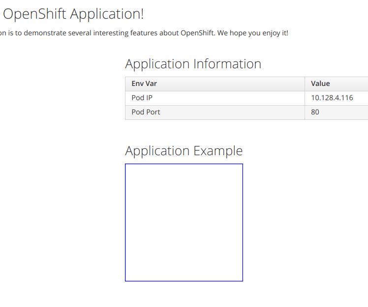

[[rollback-applications]]
Rollback Applications
~~~~~~~~~~~~~~~~~~~~~

In this lab we will rollback an application version deployment in OpenShift without switching to an older version of the source code in SCM.

In this Lab, we will:

* Use the same app we deployed in Lab 10. If you have not completed Lab 10, please
do so before commencing with this Lab.
* Rollback the application using the OpenShift v3 command `rollback`.

*Step 1: Check application health status*

* Your OC CLI terminal session should still be configured for the `scm-web-hooks-UserName` project 
* Run:

....
$ oc get pods

NAME                    READY     STATUS       RESTARTS   AGE
scm-web-hooks-1-build   0/1       Completed   0          1h
scm-web-hooks-2-85bkw   1/1       Running     0          18m
scm-web-hooks-2-build   0/1       Completed   0          19m
....

* Inspecting the output of the above command, note that there is a
single replica of the previously deployed application running.
* Additionally, note that two pods were used to build the
application. OpenShift will create and deploy a pod per
deployment. This means that we currently have two versions of the
application in place.
* You can also use `oc get dc`  ...and remember `dc` is short hand for `deploymentconfig`:

....
$ oc get dc

NAME            REVISION   DESIRED   CURRENT   TRIGGERED BY
scm-web-hooks   2          1         1         config,image(scm-web-hooks:latest)
....

* The latest and active version for the application is *2*
* If we display the application in the browser we see:

*Step 2: Rollback the application*

* Using the previous command we executed to retrieve the deployment
configuration, we will revert or rollback to version 1.

....
$ oc rollback scm-web-hooks --to-version=1
#3 rolled back to scm-web-hooks-1
....

* If we re-run the command to list the build configurations, we now see:

....
$ oc get dc

NAME            REVISION   DESIRED   CURRENT   TRIGGERED BY
scm-web-hooks   3          1         1         config,image(scm-web-hooks:latest)
....

* OpenShift has rolled back the application by deploying version 1 (labeled it with an incremented revision of 3) and created
a new build configuration.
* Refreshing the application in the browser now displays:

image:images/blue_app.jpg[image]

link:0_toc.adoc[Table Of Contents]
