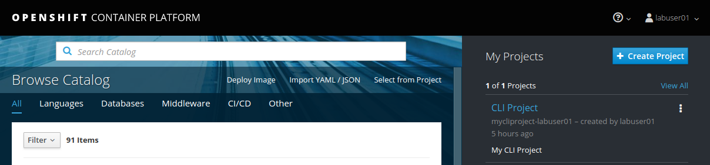

[[using-web-console]]
Using the Web Console
~~~~~~~~~~~~~~~~~~~~~

In this lab exercise, we will review the OpenShift Web Console.

Enter the master public URL provided by your instructor in a browser.
Use `<master public URL>:<port>`. You will be directed to the OpenShift
login page.

*Note*: Your browser may complain about the server’s security
certificates not trusted by your computer. You can agree to proceed to
the master URL.

image:images/login.png[image]

Key in the username and password provided by the instructor. A listing of current projects for the current user is over on the right. Note the project created in the last
lab exercise `mycliproject-UserName` is displayed here.

Also note the *Create Project* button which allows you to create a new
project from Web Console.

Click on the `mycliproject-UserName` CLI Project to view details for the project. OpenShift takes you by
default to the *Application Summary* page where general statistics for all project applications are displayed.

*Note:* If you see a message `An error occurred getting metrics.` in the browser, please do the following:

1.  Click `Open Metrics URL`
2.  Click `Advanced` link, down on lower left across the page from "Back to safety"
3.  Click `Proceed to hawkular-metrics.<> (unsafe)`
4.  The Hawkular Metrics page displays.  Close this browser tab.
4.  Back on the CLI Project page, refresh the browser either via the refesh button or via F5 key.

Click the arrow to the left of the `time` application deployment. An *Overview* pane is displayed, providing an outline of the application deployment. You can see that a single pod is
running and is front-ended by a service. Note the route that you
configured for this service is also displayed. Also notice the *Add to
Project* drop-down at the upper top right of the page, which can be used to create additional applications within this project.

image:images/project_details.png[image]

In the bar on the left hand side of the screen, select *Builds* under the *Builds* menu. All of the build
configurations will be displayed. Click into each build configuration and select the
*Configuration* tab, where you will be able to view all of the build details.

image:images/project_build_details.png[image]

Again, access the bar on the left hand side of the screen, this time selecting *Pods* under the *Applications* menu. Here you will find a running pod that
is executing your application image. Note that it also tells you how many replicas of the pod are currently running, as well as the number of restarts. You should also see the build pod that has succeeded with the `Completed` status.

image:images/project_pods.png[image]

Click into the running pod `time-1-<xxxxx>`. Details for the pod will be displayed: the internal IP address for the pod,
the OpenShift node that the pod is executing on, etc. In addition,
metrics, logs and the ability to launch a terminal session into the running pod
are all available for monitoring and troubleshooting purposes.

image:images/project_pod_details.png[image]

Click on the *Terminal* tab, and access the pod from web console. Execute the command `ps -ef` to view running processes. Execute the `exit`
command within the terminal session when complete.

image:images/terminal_view.png[image]

Click *Builds* on the left menu and select *Builds*. Select the build name
*time* and then click on the *Configuration* tab. Note there are webhook
URLs. We will use them in a later lab exercise. You can start a build
from the Web Console by pressing the *Start Build* button in the right
top corner. Additionally, a command to start the build from CLI is provided in the
*Manual (CLI)* frame, including the ability a button to copy the command to the clipboard
for easy pasting into the CLI.

image:images/project_build_configuration.png[image]

* Select *Services* under the left hand *Applications* menu, you will find the service
created for your application. Click into the service `time`, it shows
all the details about the service along with the option to expose it as
a route via the `Actions` drop-down in the top right.
* Select *Routes* under the left hand *Applications* menu, you will see all the routes
in the project. Click into the `time` route, it shows all the details for this
route.
* Select *Deployments* under the the left hand *Applications* menu, you will see all the
deployments. Click into the `time` deployment, it shows all the details of the
deployment. By pressing the *Deploy* button in the top right, you will be able to start a new
deployment process from the web console.
* Select *Monitoring* from the left hand menu, you will see all the events for the project, with the latest events grouped by resource type. All currently executing events would be listed under `Events` in the right hand frame.
* Select *Images* under the the left hand *Builds* menu, it shows the list of image streams
for the project. Click into a specific image stream, it shows more
details about the image stream.

Hover over the *Resources* menu on the left to display
the Quotas and Other Resources, if they exist. These topics will be covered in
a different lab exercise.

[[extra-credits]]
Extra Credits
^^^^^^^^^^^^^

Repeat lab 1
link:1.%20Create%20App%20From%20a%20Docker%20Image.md[creating an
application from an existing Docker Image using CLI] however this time, utilize the OpenShift Web
Console to do so.

Spend any additional time needed to familiarize yourself with the various feature of the OpenShift Web Console.

link:0_toc.adoc[Table Of Contents]
