[[using-templates]]
Using Templates
~~~~~~~~~~~~~~~

In this lab exercise we will learn how to utilize the OpenShift Web Console to
spin up a MySQL database using templates. We will then add a frontend
PHP application that accesses this database via the service exposed by
the database. We will provide a route (a URL) to enable external access to the frontend
application.

*Step 1: Create a Project*

Based on the experience gained from the previous exercise(s), log into the
OpenShift Web Console. You will see the list of Projects.

Using the *New Project* button, create a new project. Name the project
*consoleproject-UserName*, replacing *UserName* with your assigned username to make this project
unique. Enter a *Display Name* and *Description* of your choice.

Click the *Create* button to complete the project creation from the Web
Console. This will accomplish the same job as `oc new-project` from CLI.

Once created, while in the *My Projects* page, click on the name of the newly created `consoleproject-UserName` project.

*Step 2: Create a MYSQL database using the template*

Click on the *Browse Catolog* button and you will be taken to the application creation screen shown
below, where you can select an image or template.

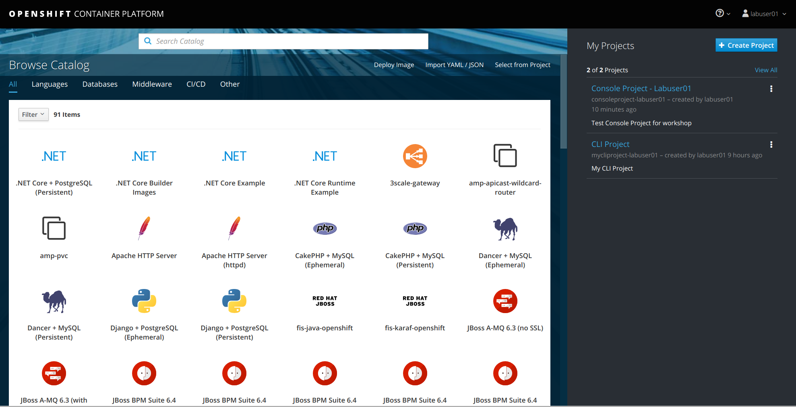

Scroll down the list and look for the *MySQL (Ephemeral)* template. Also notice that there is a *MySQL
(Persistent)* template as well...we will address persistent templates a little later in a different lab
exercise. Click on the *MySQL (Ephemeral)* template to select.

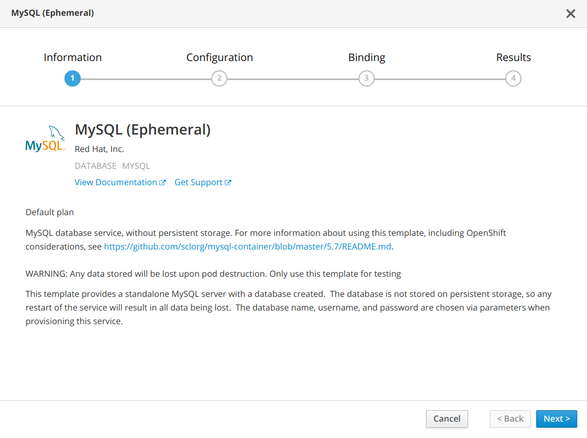

Click *Next*. You will be taken to the MySQL ephemeral template configuration screen.

For *Add to Project*, select *consoleproject-UserName* from the drop down list. For
parameters, use the following values...all other parameters, leave as is:

....
Database Service Name: mysql
MySQL Connection Username: pricelist
MySQL Connection Password: pricelist
MySQL Database Name: pricelist
....

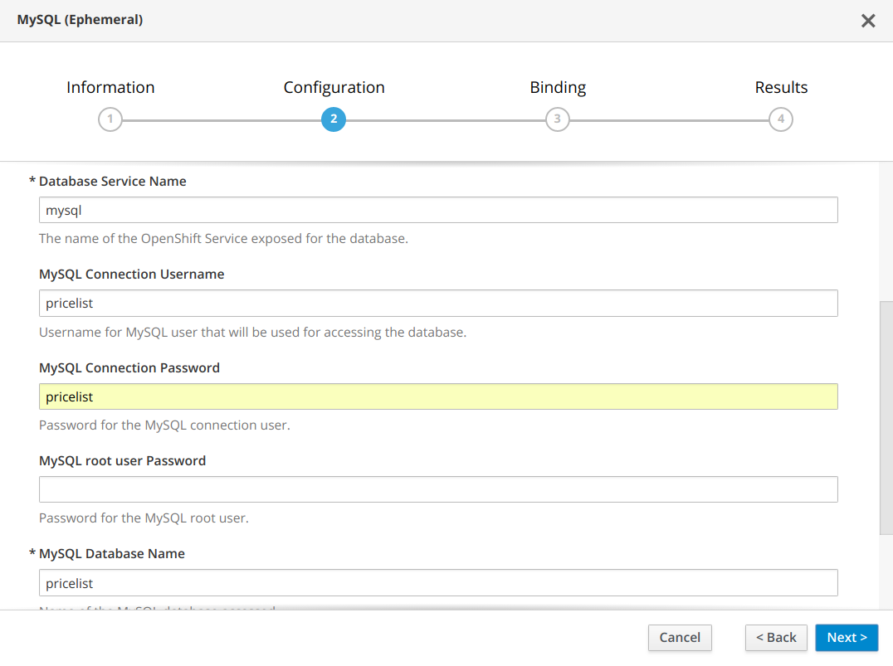

Click *Next*.

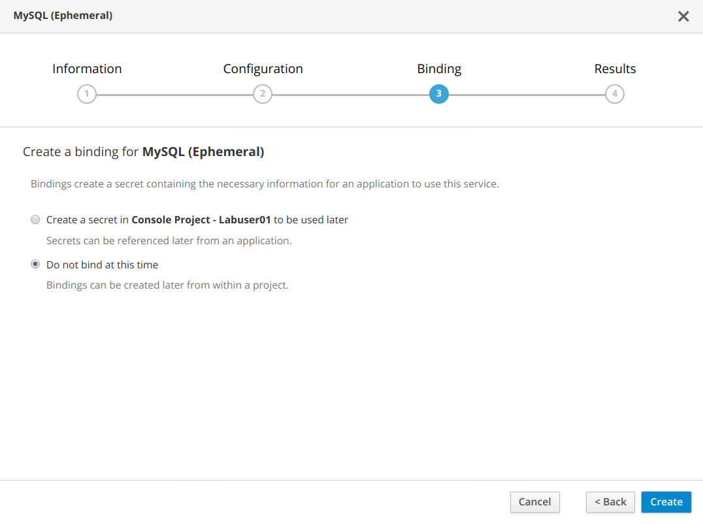

On the *Binding* screen, leave as `Do not bind at this time`. Click *Create*.

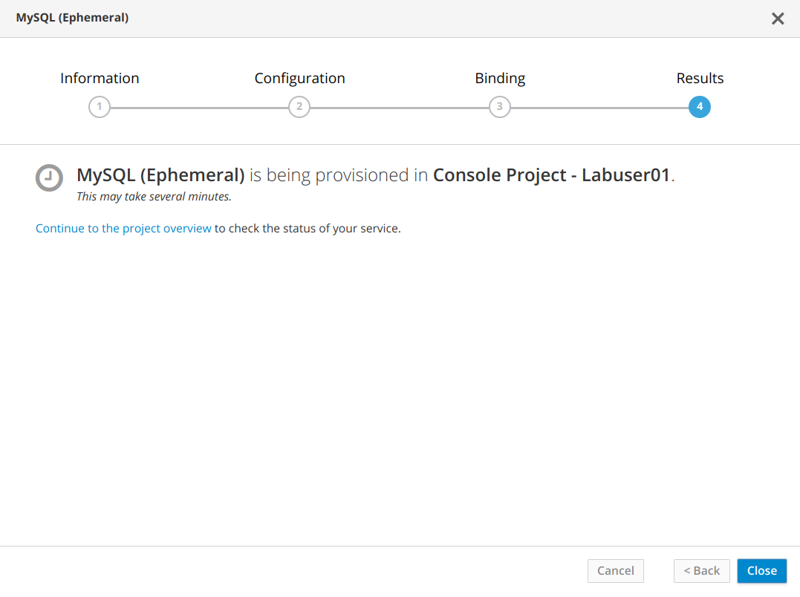

On the *Results* dialog, click `Continue to the project overview`. Here you can see the status of deployed resources.

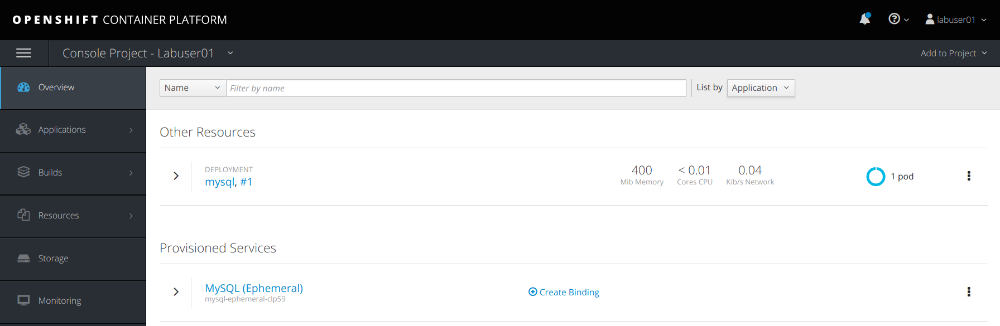

You will be taken back to the project overview page and soon you will see
an image of a running pod.

Now we need to add a 'app=pricelist' label to the MySQL database pod. Here on the project overview page,
under `Other Resources`, for the 'mysql,#1' deployment, notice over to the right where it displays `1 pod`. Click on `1 pod` 

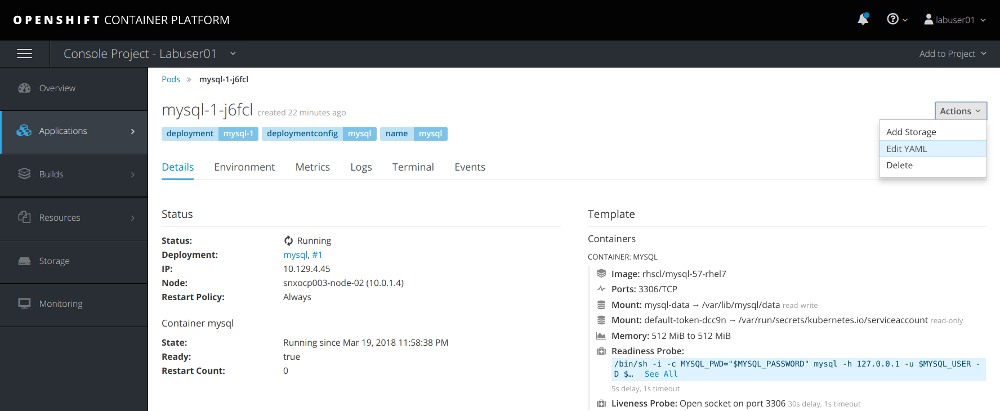

Select the `Actions` drop down and click on `Edit YAML`

image:images/mysql_pod_add_label.png[image]

Under the `labels` section, add a new line entry `app: pricelist`

Click *Save*

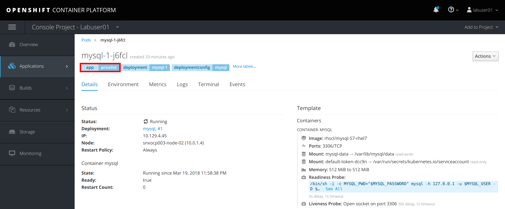

*Note:* We now have an additional label `app=pricelist` defined for the MySQL database pod.

*Step 3: Add a PHP frontend to connect to this database*

In this step we will add a PHP frontend application that talks to our
recently created database. The code is available on GitHub at
https://github.com/RedHatWorkshops/php-pricelist

Browse through the code in this repository. If you take a look at the
link:https://raw.githubusercontent.com/RedHatWorkshops/php-pricelist/master/config/database.php[database configuration] file (`config/database.php`) you will see that
it reads the values from environment varables.

To add the frontend, in the top right click on *Add to Project -> Browse Catalog* to select the frontend
application to deploy in the same *consoleproject-UserName* project. From the
*Browse Catalog* page, click on the *PHP* template icon.

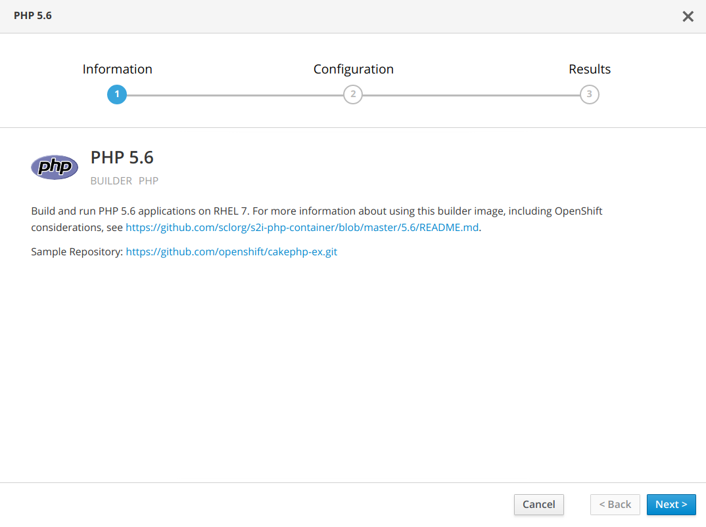

Click, *Next*. In the Configuration dialog, for `Add to Project`, select the *consoleproject-UserName* project. Enter the following parameter values:

....
* Application Name: pricelist
* Git Repository: https://github.com/RedHatWorkshops/php-pricelist
....

Click the link `advanced options`, go to Deployment Configuration section and enter the
following environment variables:

image:images/dbtest_deployment_env.png[image]

Scroll down to the Label section and verify that the following label is populated:

....
* app=pricelist
....

Click *Create* to add this frontend application and connect it with the database.

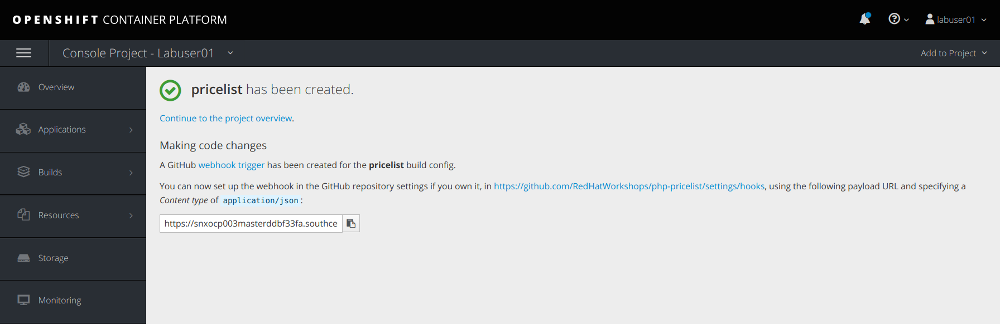

Click *Continue to the project overview*.

You will be taken back to the Project Overview page where eventually a new service entry should appear and exposed as a route. Since
you labeled both frontend web and backend db as `app=pricelist` it will
show as one application

You will also notice that a build starts running very soon. Once the
build completes, the application image created from the source code will
be uploaded to the local docker repository.

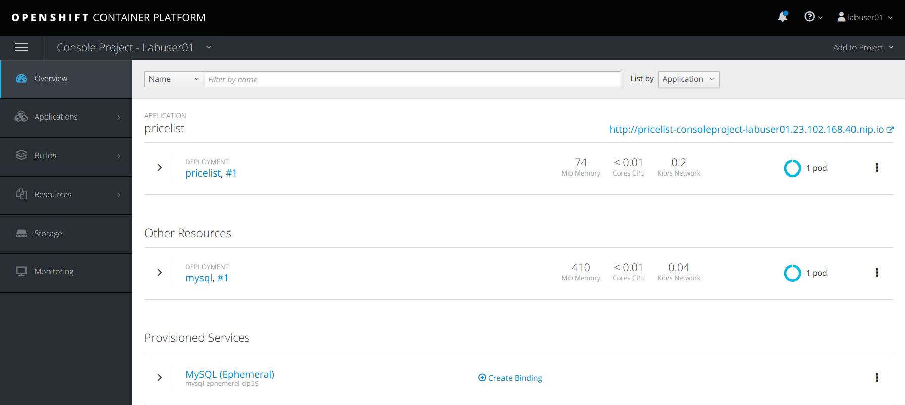

Over in your CLI console, you can check the status of the build. First, make sure to switch to the 
*consoleproject-UserName* project:

....
$ oc project consoleproject-UserName
Now using project "consoleproject-UserName on server "https://ocp.example.com:8443"...
....

Verify status of the build by viewing the log via the following command:

....
$ oc logs build/pricelist-1
Cloning "https://github.com/RedHatWorkshops/php-pricelist" ...
	Commit:	b33ca2c77e66bbeb22d4d36c9b6554e47b407b8c (Update README.md)
	Author:	Christian Hernandez <christianh814@users.noreply.github.com>
	Date:	Mon Jan 22 17:53:52 2018 -0800
---> Installing application source...
=> sourcing 20-copy-config.sh ...
---> 03:12:26     Processing additional arbitrary httpd configuration provided by s2i ...
=> sourcing 00-documentroot.conf ...
=> sourcing 50-mpm-tuning.conf ...
=> sourcing 40-ssl-certs.sh ...
Pushing image docker-registry.default.svc:5000/consoleproject-UserName/pricelist:latest ...
Pushed 0/6 layers, 17% complete
Pushed 1/6 layers, 21% complete
Pushed 2/6 layers, 37% complete
Pushed 3/6 layers, 54% complete
Pushed 4/6 layers, 80% complete
Pushed 5/6 layers, 100% complete
Pushed 6/6 layers, 100% complete
Push successful
....

Once the build completes, OpenShift initiates a deploy process. Once the
deployment is complete, the frontend pod starts running. You will find
the running pod when you navigate to *Applications->Pods* on the Web
console.

Now use `curl` to run the database `bootstrap` script
....
$ curl -k http://$(oc get route/pricelist -o jsonpath='{.spec.host}')/create_database.php
Array
(
    [0] => 00000
    [1] =>
    [2] =>
)

....

Go ahead and open your application. The URL to use will be displayed by `oc get route`

....
$ oc get route
NAME        HOST/PORT                                                    PATH      SERVICES    PORT       TERMINATION   WILDCARD
pricelist   pricelist-consoleproject-Username.apps.example.com 	                   pricelist   8080-tcp                 None
....

When you open your application, click on the "Create Record" button and create a record.
Once you added a record, click on "Read Records". The page should look
like this.

image:images/application_create_screen.png[image]

You can verify this by logging into the database using `oc rsh` in the CLI console, where `rsh` stands for 'remote shell'

....
$ oc get pods
NAME                READY     STATUS      RESTARTS   AGE
mysql-1-rxnlp       1/1       Running     0          25m
pricelist-1-build   0/1       Completed   0          13m
pricelist-1-z55t2   1/1       Running     0          12m
....

Above, notice that the database pod is called `mysql-1-rxnlp`. Substitue the name of your MySQL pod for the following commands. Login to this pod using `oc rsh`

....
$ oc rsh mysql-1-rxnlp
sh-4.2$
....

Execute `mysql -u root pricelist` to login, followed by executing `select * from products;` to perform the database query.
....
sh-4.2$ mysql -u root pricelist
Welcome to the MySQL monitor.  Commands end with ; or \g.
Your MySQL connection id is 326
Server version: 5.7.16 MySQL Community Server (GPL)

Copyright (c) 2000, 2016, Oracle and/or its affiliates. All rights reserved.

Oracle is a registered trademark of Oracle Corporation and/or its
affiliates. Other names may be trademarks of their respective
owners.

Type 'help;' or '\h' for help. Type '\c' to clear the current input statement.

mysql> select * from products;
+----+-----------+----------------------------------------------+-------+-------------+---------------------+---------------------+
| id | name      | description                                  | price | category_id | created             | modified            |
+----+-----------+----------------------------------------------+-------+-------------+---------------------+---------------------+
| 14 | OpenShift | Build, deploy, and manage your applications! |  5000 |           4 | 2017-08-21 22:06:28 | 2017-08-21 22:06:28 |
+----+-----------+----------------------------------------------+-------+-------------+---------------------+---------------------+
1 row in set (0.00 sec)

mysql> \q
....

Finally, exit from the pod...

....
sh-4.2$ exit
....

In this lab exercise, we deployed a complete web application 
using OpenShift templates via a two step process. First, we deployed the MySQL
database. We added data manually via direct interaction within the pod. Then we added
the frontend code that was built using the OpenShift S2I process. The frontend application was
configured to access the database using a
service, in this case, the ``mysql'' service. Fianlly, the frontend was made
accessible by creating a route for which a URL definition was provided.

link:0_toc.adoc[Table Of Contents]
