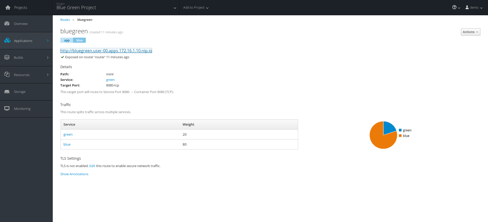

[[blue-green-deployments]]
Blue-Green Deployments
~~~~~~~~~~~~~~~~~~~~~~

The purpose of this short lab is to demonstrate how simple it is to
implement Blue-Green Deployments in OpenShift v3.

----
Blue-Green deployment is a release strategy for deploying software in a production environment.
Blue would be one particular production environment version whereas green is an identical production
environment, save for the version of the application code base that is deployed. Utilizing a Blue-Green
deployment strategy can minimize production application downtime and reduce risk overall.
https://en.wikipedia.org/wiki/User:Nuqing/Blue-green_deployment[1*]
----

In this Lab, we will be:

* Deploying two versions of the same application. First version will
display a blue rectangle, second version a green rectangle.
* Create a FQDN that can be used to expose the applications.
* Initially expose the first application.
* Create a second version of the application in the same
project.
* Switch the FQDN from the first application (blue) to
the second application (green).

image:images/blue_green_deployment.png[image]

[[part-i]]
Part I
^^^^^^

*Step 1: Create a new project*

*Remember* to replace *UserName* with the username assigned to you in the commands below.

....
$ oc new-project bluegreen-UserName --display-name="Blue Green Project" --description="Blue Green Project"
....

*Step 2: List existing image builder or image streams*

....
$ oc new-app -S --image-stream=php

Image streams (oc new-app --image-stream=<image-stream> [--code=<source>])
-----
php
  Project: openshift
  Tags:    5.5, 5.6, latest
....

*Step 3: Create an application*

We will be working with a sample application that displays a blue or green
rectangle. The sample app can be browsed at
https://github.com/RedHatWorkshops/bluegreen

In this lab, an environment variable is utilized to change the color of the box; however
in practice, a different branch for each version of the
code is typically deployed. (E.g. v1 branch and v2 branch)

....
$ oc new-app --image-stream=php --code=https://github.com/RedHatWorkshops/bluegreen --env COLOR=blue --name=blue
....

*Step 4: Monitor the application build*

....
$ oc get builds

NAME      TYPE      FROM          STATUS     STARTED              DURATION
blue-1    Source    Git@afdc492   Complete   About a minute ago   1m8s
....

Using the build name (listed above) of the recently created application, run:

....
$ oc logs build/blue-1
....

Once the build finishes, scan the resulting output until the image push is succesful:

....
...
---> Installing application source...

Pushing image 172.30.89.28:5000/bluegreen-admin/blue:latest ...
Pushed 0/5 layers, 2% complete
Pushed 1/5 layers, 24% complete
Pushed 2/5 layers, 46% complete
Pushed 3/5 layers, 68% complete
Pushed 3/5 layers, 100% complete
Pushed 4/5 layers, 100% complete
Pushed 5/5 layers, 100% complete
Push successful
....

*Step 5: Check application deployment status*

....
$ oc get pods

NAME           READY     STATUS       RESTARTS   AGE
blue-1-build   0/1       Completed    0          4m
blue-1-ruyrt   1/1       Running      0          19s
....

Notice that the build pod has exited and a single instance
of the application is running under one pod.

This application displays a blue square.

*Step 6: List the service*

....
$ oc get service
....

*Step 7: Create a route for the application*

*Don't forget* to replace *UserName* with the username assigned to you. Expose the service:

....
$ oc expose service blue --hostname=bluegreen.UserName.<<DomainNameSuffix>> --name=bluegreen
....

*Step 8: Test the application*

....
$ oc get route
....

Copy the HOST/PORT and paste it in your browser. You should see
something similar to:

image:images/blue_deployment.jpeg[image]

At this point, for illustration purposes, you have deployed an application that displays  a blue
rectangle for version 1.

[[part-ii]]
Part II
~~~~~~~

In this portion of the lab, we will:

* Deploy a new version of this application
* Point the previously created FQDN (route) to the new service that will
be defined as part of the new application creation process.

image:images/blue_green_active_green.png[image]

*Step 1: Create new version of the application*

Create a new application following the same steps as above in Part I. However, in this case,
name the application `green' instead of 'blue'.

....
$ oc new-app --image-stream=php --code=https://github.com/RedHatWorkshops/bluegreen --env COLOR=green --name=green
....

* Wait until the application is built and deployed. You should now see
two services, execute the command `oc get service`:

....
$ oc get service

NAME      CLUSTER-IP       EXTERNAL-IP   PORT(S)    AGE
blue      172.30.2.161     <none>        8080/TCP   24m
green     172.30.136.184   <none>        8080/TCP   1m
....

* Modify the previously created route to point to the newly created service by changing the `Service` name from `blue` to `green` (at the bottom, under kind: Service). You are essentially still using the FQDN you had
previously created, however, that route will now point to a different
(green) service.

....
$ oc edit route bluegreen

apiVersion: v1
kind: Route
metadata:
  creationTimestamp: 2015-12-22T19:16:28Z
  labels:
    app: green
  name: bluegreen
  namespace: bluegreen-UserName
  resourceVersion: "2969408"
  selfLink: /oapi/v1/namespaces/bluegreen-UserName/routes/bluegreen
  uid: 80829b59-a8e0-11e5-be21-fa163ec58dad
spec:
  host: bluegreen.UserName.apps.osecloud.com
  port:
    targetPort: "8080"
  to:
    kind: Service
    name: green
status: {}
....

*Step 2: Test the application*

....
$ oc get route
....

* Copy the HOST/PORT and paste it in your browser.
* The new version of the recently deployed
application is displayed: a green rectangle.

[[part-iii]]
Part III
~~~~~~~

You can route traffic to both services. This is what is typically referred to as a "canary deployment". 

*Step 1: Edit Your Route*

Using the left-hand side navigation; click on *Applications -> Routes*. This will 
bring you to the `Route` overview page.

image:images/bg-routes-page.png[image]

Here, click on the  `bluegreen` route. The current route configuration will be displayed.
On the upper right hand side, click on *Actions -> Edit*. You should see a page similar to
this one.

image:images/bg-edit-route.png[image]

Next, tick on `Split traffic across multiple services`

image:images/bg-slipt-traffic.png[image]

Set the weight to 80% on blue and 20% on green. The majority of the traffic will be passed to the green application, with the rest passed to the blue application.

image:images/bg-5050-split.png[image]

Once you click on *Save*; you should see this on the Route Overview page.

*Step 2: Test Your Settings*

If you try and visit your application; you'll notice it won't "switch" over
to the other application. This is because the default behavior is:

* Sticky Session on the Router
* Session Cookie set on the router

To get "true" round robin; annotate your route with the following

....
oc annotate route/bluegreen haproxy.router.openshift.io/balance=roundrobin
oc annotate route/bluegreen haproxy.router.openshift.io/disable_cookies=true
....

[[summary]]
Summary
~~~~~~~

* Blue-Green deployments can be easily accomplished in OpenShift v3.
* We have shown multiple versions of an application; all running
concurrently, each with a unique service.
* All that is needed to expose any of the applications is to change the
service being used by the route to publicly advertise the application.
* You can split traffic accross two services

link:0_toc.adoc[Table Of Contents]
